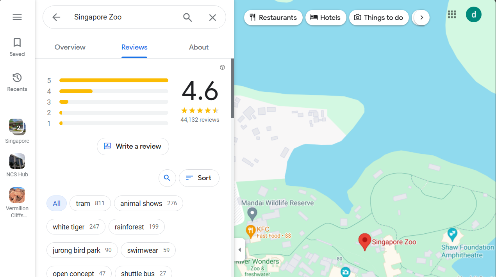

# Scrape 3 years of Google reviews using `Selenium` and `BeautifulSoup`

## Purpose

These codes try to scrape Google reviews of attractions using a webdriver

## Libraries used

`Selenium`
`pandas`
`numpy`
`scipy`
`bs4`
`datetime`
`time`
`scipy`

## How to scrape google reviews

1. Go to `scrape_wrapper.py`
2. Go to google maps and search for the attraction then click on reviews
3. Run the program
4. Copy the link and place it for the `url`
5. Name the file
6. Assign `minutes_to_scrape` to a high number so that reviews from 3 years back are recorded

**Notes**: 
* Do not close or stop the application halfway
* A medium-popularity attraction took 60 mins to scrape 3 years back
* `check_every_interval` checks the web driver at this interval to see if data from all of 3 years have been scraped

## Example of google review website

[Google maps link](https://www.google.com/maps/place/Singapore+Zoo/@1.4043485,103.7904481,17z/data=!4m8!3m7!1s0x31da13d9102adcaf:0xb414fac8a43b1b91!8m2!3d1.4043485!4d103.793023!9m1!1b1!16zL20vMDIxMW16?entry=ttu)

## Dealing with incomplete data

Some reviews take a very long time scrape and may crash so we would not able to scrape all 3 years

In that case we have to extend the incomplete data from the one we already scraped

`scrape_wrapper` automatically extends the review to `2 years ago`

## Statistical methods used to extend

Google reviews take values from 1-5 and we notice that for very large-popular attractions the scrape only goes back to 8 months ago

Define 
$$X \sim 1 + Bin(4,p)$$

Then this R.V can take values from 1-5 and can model one single review

We estimate $p$ by taking the mean of the reviews 

Define
$$Y \sim Poisson(\lambda)$$

This can model the amount of reviews left and $\lambda$ can be estimated by counting the amount of reviews left in a month
